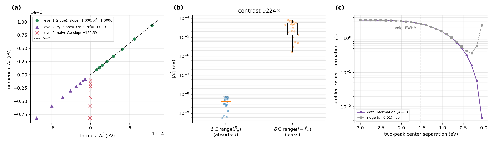

# Misspecification bias of `VarProFitter`: a projection-law validation

*Companion artifact to `examples/04_projection_law_validation.py` (deterministic, seed=42;
regenerates the figure and all numbers below). Theory: the projection-bias law for separable
inverse problems, derived in the companion paper **[REF: IP companion, in preparation]**.*

## What is being validated

Voigt peak fitting is a *separable* estimator: with the peak center $t$ fixed, the model
$I = A(t)\,C$ is linear in $C$ (amplitudes + polynomial background), and `voigtfit`
eliminates $C$ exactly as in variable projection — Stage 1 amplitude recovery *is* the
VarPro inner solve. For any such estimator, a first-order law predicts how a systematic,
unrepresentable model error $\delta$ (an asymmetric tail, a weak satellite, an imperfect
background) biases the fitted center:

$$\Delta\hat t \;\approx\; \frac{\langle s_t,\,(I-P_\alpha)\,\delta\rangle}{g''_{tt}},
\qquad g''_{tt} = \langle s_t,\,(I-P_\alpha)\,s_t\rangle,$$

with $s_t = a_0\,\partial v/\partial t$ the center-sensitivity vector (an odd shape localized
at the peak), $P_\alpha$ the (regularized, possibly constrained) hat matrix of the linear
subproblem, and $g''_{tt}$ the profiled Fisher information of the center. In words: **an error
biases the center only through its component in the subspace the fit cannot absorb**, scaled
by the inverse of the center's information.

## Results (all from the example script, seed=42)

| level | inner solver | regime | result |
|---|---|---|---|
| 1 | analytic ridge, amplitude bounds inactive | resolved peak | **slope 0.9998, R² 1.0000000** |
| 2 | box-constrained ridge, neighbor amplitude **pinned at its $a\ge0$ bound** | constrained | **tangent-space projector: slope 0.993, R² 1.0000000**; naive unconstrained projector: slope 152.6 (**fails by ~150×**) |
| 3 | **production `VarProFitter`** | production | **slope 1.0004, R² 0.99999** |

- **Subspace immunity (panel b).** A fixed-norm $\delta$ inside $\mathrm{range}(P_\alpha)$ is
  absorbed by the amplitude/background estimate (median center shift $4\times10^{-9}$ eV);
  its null-complement leaks to the center ($4\times10^{-5}$ eV) — a **9000× contrast**.
  Practical use: given any candidate systematic (background residual, satellite, asymmetry),
  its *leak fraction* $\|(I-P_\alpha)\delta\|/\|\delta\|$ and overlap with $(I-P_\alpha)s_t$
  rank its danger to the center *before* any refit.
- **Identifiability boundary (panel c).** As a two-peak separation shrinks below the Voigt
  FWHM, the data-supplied $g''_{tt}$ collapses by nearly three orders of magnitude — the
  center becomes non-identifiable, and the law switches from predicting a bias to certifying
  that no data-driven center estimate exists. (A ridge penalty retains an $\alpha$-supplied
  floor; that curvature is prior information, not data.)
- The Voigt design column is verified identical to `toyomacro.voigtfit.voigt_profile`
  (max rel. err 0.0), so the validation runs on the library's own basis.

## The level-3 statement, precisely

`VarProFitter` reproduces the law at production precision **because its estimator class —
ridge-free variable projection with $\sigma$ co-fit — matches the law's assumptions**
(separability, low-dimensional nonlinear parameter, consistency at $\delta=0$). The $\sigma$
co-fit does not interfere at a symmetric anchor: a width perturbation is even about the
center while $s_t$ is odd. This should **not** be read as "any production solver validates
the law": the companion paper's depth-profiling instance uses an $\ell_1$-regularized
solver, a different estimator class, and there the ridge-linearized law is only
directionally correct (slope ≈ 0.3, R² ≈ 0.95).

## Why this matters for `voigtfit` users

XPS peak positions carry chemical-state assignments; systematic lineshape error (unmodeled
asymmetry, plasmon/satellite structure, background curvature) is endemic. The projection law
turns "how wrong could my center be?" into a computable, operator-only diagnostic: a
worst-case center bias $\|\delta\|/\sqrt{g''_{tt}}$ from quantities the fit already has, and
a certificate ($g''_{tt}\to0$) for when overlapping components make the question itself
ill-posed. CRLB utilities in this package bound the *statistical* error; the projection law
bounds the *systematic* one — together they give both halves of the error budget.

| | depth profiling (companion paper) | peak fitting (this package) |
|---|---|---|
| nuisance $C$ | concentration profile | amplitudes + polynomial background |
| parameter $t$ | film thickness | peak center |
| $s_t$ | erf-derivative at the interface | $\partial v/\partial t$ at the peak |
| $\delta$ | inelastic bg / non-dipole | asymmetry / satellite |
| non-identifiability | interface below probing depth | peaks merged below FWHM |
| law (identifiable side) | slope 1.005, R² 1.0000 | slope 0.9998, R² 1.0000000 |
| production solver | $\ell_1$-SLSQP: directional (0.32) | VarPro: exact (1.0004) |

*Regenerate:* `python examples/04_projection_law_validation.py` (numpy/scipy/matplotlib +
this package). Raw numbers: `examples/output/04_projection_law_validation.json`.
